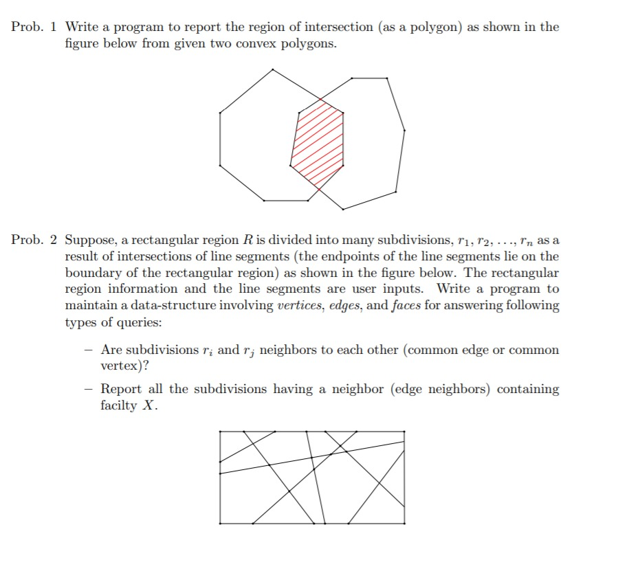
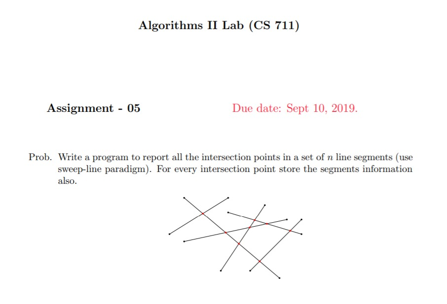
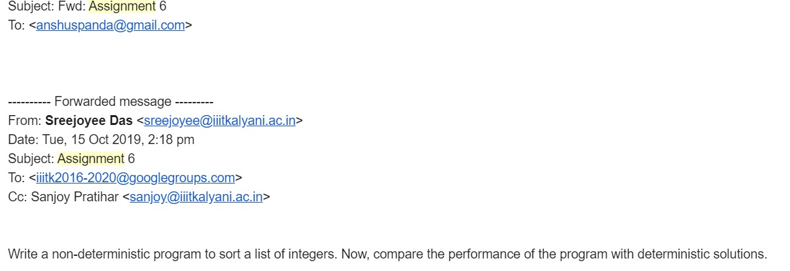
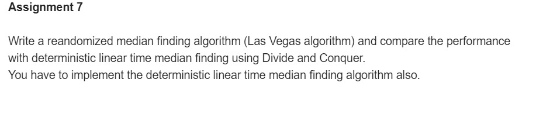
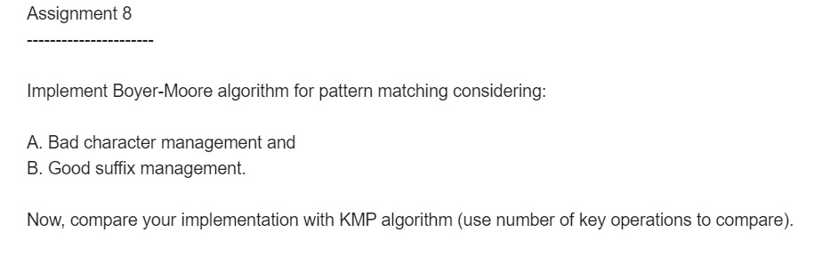

# Algorithms
 7th Semester - Algorithms II Assignments
 
 <h3>Assignment 1</h3>
  
  
 

 
 
<h3>Assignment 2</h3>
 
 
 

 
 
<h3>Assignment 3</h3>
 
 
 

 
 
<h3>Assignment 4</h3>
 
 
 

 
 
<h3>Assignment 5</h3>
 
 
 

 
 
<h3>Assignment 6</h3>
 
 
 

 
 
<h3>Assignment 7</h3>
 
 
 

 
 
<h3>Assignment 8</h3>
 
 

Draw a circle with given random points that includes all the points.

 
 
<h3>Assignment 9</h3>
 
 
 

 

